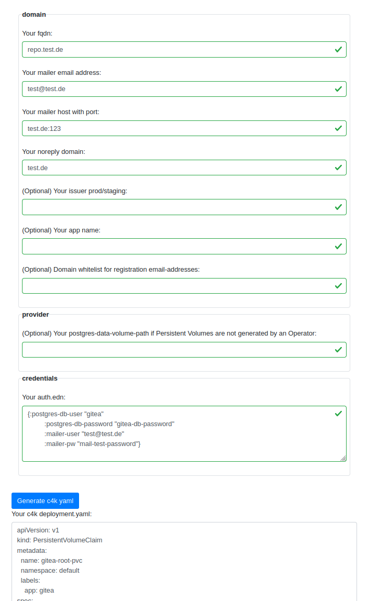

# convention 4 kubernetes: c4k-forgejo
  

[ chat over e-mail](mailto:buero@meissa-gmbh.de?subject=community-chat) | [ team@social.meissa-gmbh.de](https://social.meissa-gmbh.de/@team) | [Website & Blog](https://domaindrivenarchitecture.org)

## Purpose

c4k-forgejo provides a k8s deployment file for forgejo containing:

* forgejo
* test federated forgejo
* ingress having a letsencrypt managed certificate
* postgres database
* encrypted backup on S3 & restore
* monitoring on graphana-cloud

c4k-forgejo is an example how to create efficient k8s one shot deployments with https://repo.prod.meissa.de/meissa/c4k-common.

## Try out

Click on the image to try out live in your browser:

Your input will stay in your browser. No server interaction is required.

## Forgejo setup

After having deployed the yaml-file generated by the c4k-forgejo module you need to complete the setup for forgejo:

* Open the URL of your forgejo-server, and you will be shown a configuration page.
* Adjust the settings according to your needs
* Add the administrator's data (name, password and email) and submit the page.
* The required database will be created and the forgejo setup will be completed.
* The SSH-URL for a repo has the format: "ssh://git@domain:2222/[username]/[repo].git
  Example: "git clone ssh://git@repo.test.meissa.de:2222/myuser/c4k-forgejo.git"

### Add Impressum

In order to customize the UI e.g. for adding an Impressum, see the [Forgejo Docs](https://forgejo.org/docs/latest/developer/customization/#adding-links-and-tabs).
The individually needed files have to be added by hand into the directory `/data/gitea/templates/custom/` in the forgejo Pod. Since a PV is mounted under `/data`, these ui customizations are persisted.

## Development & mirrors

Development happens at: https://repo.prod.meissa.de/meissa/c4k-forgejo

Mirrors are:

* https://gitlab.com/domaindrivenarchitecture/c4k-forgejo (CI)
* https://codeberg.org/meissa/c4k-forgejo (issues and PR)
* https://github.com/DomainDrivenArchitecture/c4k-forgejo

For more details about our repository model see: https://repo.prod.meissa.de/meissa/federate-your-repos

## License

Copyright © 2023 meissa GmbH
Licensed under the [Apache License, Version 2.0](LICENSE) (the "License")
Pls. find licenses of our subcomponents [here](doc/SUBCOMPONENT_LICENSE)