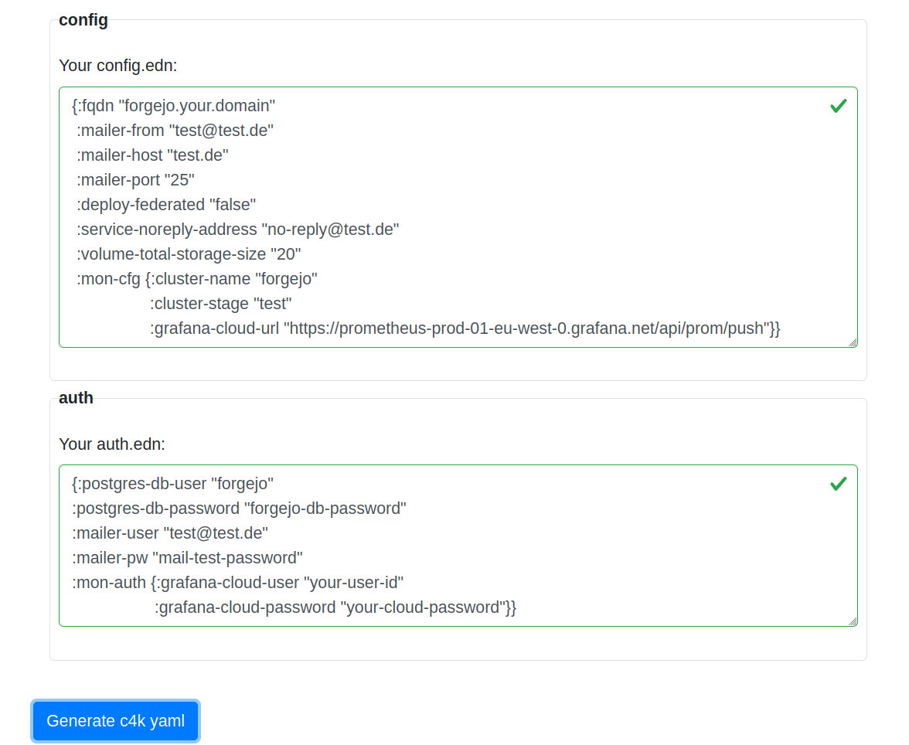

# convention 4 kubernetes: c4k-gitea
[](https://clojars.org/org.domaindrivenarchitecture/c4k-gitea) [](https://gitlab.com/domaindrivenarchitecture/c4k-gitea/-/commits/main) 

[ chat over e-mail](mailto:buero@meissa-gmbh.de?subject=community-chat) | [ team@social.meissa-gmbh.de](https://social.meissa-gmbh.de/@team) | [Website & Blog](https://domaindrivenarchitecture.org)

## Purpose

c4k-gitea provides a k8s deployment file for Gitea containing:
* gitea
* ingress having a letsencrypt managed certificate
* postgres database


## Try out

Click on the image to try out live in your browser:

[](https://domaindrivenarchitecture.org/pages/dda-provision/c4k-gitea/)

Your input will stay in your browser. No server interaction is required.

You will also be able to try out on cli:
```
target/graalvm/c4k-gitea src/test/resources/valid-config.edn src/test/resources/valid-auth.edn | kubeval -
target/graalvm/c4k-gitea src/test/resources/valid-config.edn src/test/resources/valid-auth.edn | kubectl apply -f -
```

## Gitea setup

After having deployed the yaml-file generated by the c4k-gitea module you need to complete the setup for gitea:

* Open the URL of your just deployed gitea-server and you will be shown a configuration page.
* Add the administrator's data and submit the page.
* The required database will be created and the Gitea setup will be completed.


## License

Copyright © 2022 meissa GmbH
Licensed under the [Apache License, Version 2.0](LICENSE) (the "License")
Pls. find licenses of our subcomponents [here](doc/SUBCOMPONENT_LICENSE)