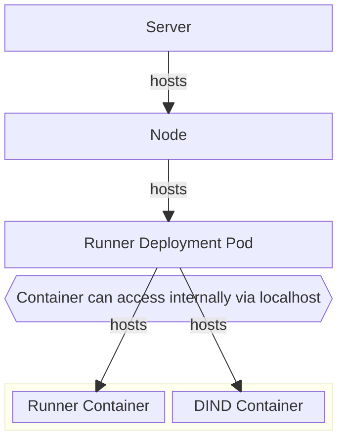

# Forgejo Runner Setup & Config

## Actions

### Caveats

* When the workflow file is invalid, there will be no error shown on the forgejo web-ui. Instead the workflow will just not appear on push. Errors can be followed in the forgejo logs though.

* The workflow file needs to exist on main to be picked up, even for branches and it needs to have triggers
  * ```yaml
    name: build-website
    on:
        pull_request:
        push:
        workflow_dispatch:
    ```

### Getting actions

Actions code is hosted [here](https://code.forgejo.org/actions).
```yaml
#Example:
name: build-website

on:
  pull_request:
  push:
  workflow_dispatch:

jobs:
  build-site:
    runs-on: ubuntu-latest
    container:
      image: 'node:24.4'
    steps:
      - name: checkout-code
        uses: https://data.forgejo.org/actions/checkout@v4
```

### Secrets & Variables

Secrets and variables can be set on different levels:
* Repo
* Owner
* Org

They can always be found in the settings under Runner.

See secrets documentation here: https://forgejo.org/docs/latest/user/actions/basic-concepts/#secrets

```yaml
# Accessing secrets and vars example
name: build-website

on:
  pull_request:
  push:
  workflow_dispatch:

jobs:
  build-site:
    runs-on: ubuntu-latest
    container:
      image: 'node:24.4'
    steps:
      - name: build
        env:
          USER: ${{ vars.WEBSITE_USER }}
          TOKEN: ${{ secrets.WEBSITE_USER_TOKEN }}
        run: |
            echo "Hi, ${USER} placing your token ..."
            echo "${TOKEN}" > ~/.token
```

## Uploading Artifacts

See here: https://forgejo.org/docs/latest/user/packages/generic/
In the generic case, this is only a curl command with authentication.

## Runner

### Runner Installation

We use the install [via OCI Image](https://forgejo.org/docs/v11.0/admin/actions/runner-installation/).

### Runner Registration

Two registration steps need to be done:

* On the runner side
    * The runner needs to know the service address of the forgejo instance
    * The runner needs to be given a name and a registration token
    * Inside the container: `forgejo-runner create-runner-file --secret ${RUNNER_TOKEN} --name ${RUNNER_NAME} --instance ${FORGEJO_INSTANCE_URL};`
* On the instance side
    * The instance needs to be informed about the runner name and token
    * Inside the container: `su -c "forgejo forgejo-cli actions register --name ${RUNNER_NAME} --secret ${RUNNER_TOKEN}" git`
* The runner name will be inserted by c4k-forgejo
* The runner token will be made available via kubernetes secret to the instance and the runner
    * The token must be a 40-character long string of hexadecimal numbers.
    * The first 16 characters will be used as an identifier for the runner, while the rest is the actual secret.

## Runner Config

Configuration [via configmap](https://code.forgejo.org/forgejo/runner/issues/132#issuecomment-4848)

### Automated Runner Setup

Is done by a kubernetes batch job. The forgejo pod needs to run for a bit to finish setup.
So a setup-job for the runner itself tries registration in its own pod with forgejo data volumes mounted is used. This way there is no need to programatically alter the main deployment, we just start this job when needed and after successful finish the runner will pick up connection to the forgejo pod.

### Runner Deployment Internal Architecture



### Links

- Labels: https://forgejo.org/docs/latest/admin/actions/#choosing-labels
- Runner Config: https://forgejo.org/docs/next/admin/runner-installation/#configuration
- Runner Kubernetes Resource Examples: https://code.forgejo.org/forgejo/runner/src/branch/main/examples/kubernetes/dind-docker.yaml
